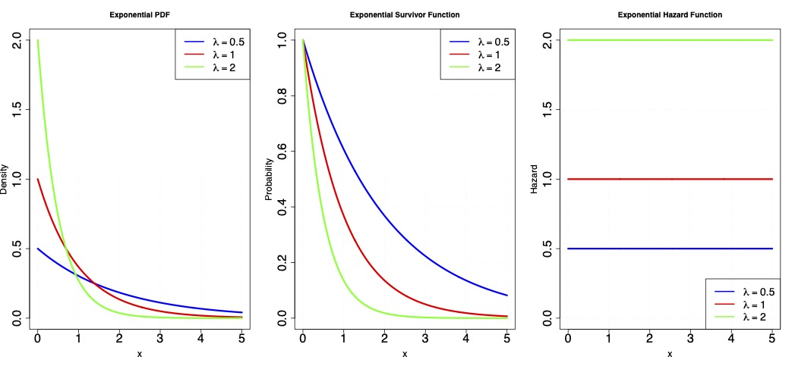
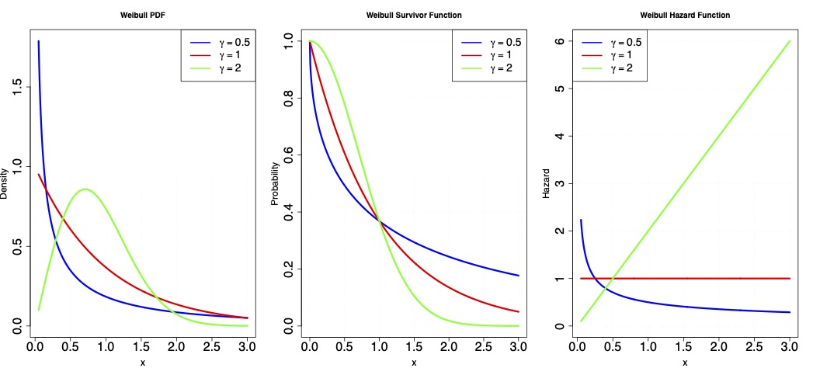

## Agenda

- Review
  - Parametric survival models
- Censoring
- Introduction to non-parametric hazards-based methods 
 - Kaplan-Meier
- Some time to briefly organize group work
 

## Review

Exponential distribution:

- characterized by a single "rate" parameter $\lambda$
  - $\mathbb{E}[T] = \frac{1}{\lambda}$
- $f(t)= \lambda exp(-\lambda t)$
- $F(t) = 1- exp(-\lambda t)$
- $S(t) = exp(-\lambda t)$
- A constant hazard model


## Review

{width="50%"}

## Review

Exponential distribution:

- in the exponential family: GLMs!
- canonical link function is the identity
- $\mathbb{E}[T \mid A] = \beta_0 + \beta_1A$
- $\lambda(t \mid A) = \frac{1}{\beta_0 + \beta_1A}$
- $S(t \mid A) = exp\Big(-\frac{t}{\beta_0 + \beta_1A}\Big)$


## Review

The *Weibull distribution* generalizes the exponential distribution, and has two parameters

-  $\lambda$:  the *scale* parameter    
-  $\gamma$: the *shape* parameter

$$\begin{align*}
S(t) &= e^{-\lambda t^\gamma} \\
f(t) &=  \frac{-d}{dt}S(t)=\gamma \lambda t^{\gamma-1}
e^{-\lambda t^\gamma}\\
\lambda(t) &= \gamma \lambda t^{\gamma-1}\\
\Lambda(t) &= \int_0^t\lambda(u) du = \lambda t^\gamma
\end{align*}$$


## Review{.smaller}

-  $\gamma=1 \rightarrow \mbox{ constant hazard}$ 
-  $0<\gamma<1 \rightarrow \mbox{ decreasing hazard}$ 
-  $\gamma > 1 \rightarrow \mbox{ increasing hazard}$

{width="50%"}


## Parametric survival

 - Parametric models are nice because we can write down the likelihood
 - With the likelihood, we can do MLE
 - But to evaluate the likelihood we need to observe all of the data...

## Limitations of parametric survival analysis

- Censoring in a fundamental feature of survival data:
- In most studies, we do not measure $T$ for all individuals
  - instead, we measure some other variable $T^*$
  - $X$ is the time an individual is "lost-to-follow-up"
  - $T^* := min(X, T)$
  - $C$ indicates whether a person was censored, i.e., $C = I(X<T)$
  
## Censoring

Sources of censoring:

- studies end at a particular calendar date. 
- individuals drop out of a study
  - possibly because of side-effects of one of the treatments...
  
## Censoring

- Most practical methods in survival analysis seek to solve a more difficult problem than regular statistical objectives: do inference on $S(t)$ using incomplete data on $T$. 
    - For some individuals we observe $T$ directly, for other individuals we only partially observe $T$
    - partial observation of the **event process**.
- we need **assumptions** to do inference on $S(t)$
- we will need to do **identification** and we will end up with more exotic estimators directly motivated by this process.

## Censoring

To motivate some approaches that work in the presence of censoring, lets first consider an example without censoring and discrete time points.

- *Time to relapse* (weeks) for 21 leukemia patients who received control treatment\footnote{Table 1.1 of Cox \& Oakes, 1984}: 

  - 1, 1, 2, 2, 3, 4, 4, 5, 5, 8, 8, 8, 8, 11, 11, 12, 12, 15, 17, 22, 23

- How would you estimate a survival curve without parametric assumptions?...
- Let's return to our event process.
- What is the probability that an individual survives more than 10 weeks?
  - $\widehat{S}(10) = P(Y_{10}=0) = \widehat{P}(T > 10)=8/21 = 0.38$ (since 8 people survived more than 10 weeks)
- What about the probability that an individual survives more than 8 weeks?
  - $\widehat{S}(8) =  \widehat P(T > 8) = 8/21 = 0.38$ (the four events at 8 weeks are counted as having already failed)

## Censoring

Generally...
$$
\widehat{S}(t) = \frac{\#~individuals~ with~T > t}{total~sample~size}
$$

## Empirical survival function{.smaller}

1, 1, 2, 2, 3, 4, 4, 5, 5, 8, 8, 8, 8, 11, 11, 12, 12, 15, 17, 22, 23

::: {.smaller}
| Values of $t$  | \# individuals with $T > t$ | $\widehat{S}(t)$ |
|:-----------------|-------------------------------:|-------------------:|
| $0  \le t < 1$ | 21 | $21/21 = 1.000$ |
| $1  \le t < 2$ | 19 | $19/21 = 0.905$ |
| $2  \le t < 3$ | 17 | $17/21 = 0.809$ |
| $3  \le t < 4$ | 16 | $16/21 = 0.762$ |
| $4  \le t < 5$ | 14 | $14/21 = 0.667$ |
| $5  \le t < 8$ | 12 | $12/21 = 0.571$ |
| $8  \le t < 11$ | 8  | $8/21 = 0.381$ |
| $11 \le t < 12$ | 6  | $6/21 = 0.286$ |
| $12 \le t < 15$ | 4  | $4/21 = 0.191$ |
| $15 \le t < 17$ | 3  | $3/21 = 0.143$ |
| $17 \le t < 22$ | 2  | $2/21 = 0.095$ |
| $22 \le t < 23$ | 1  | $1/21 = 0.048$ |
:::


## Censoring...

Consider time to relapse (weeks) for leukemia patients in the treatment group.\footnote{Table 1.1 of Cox and Oakes} Times with $^+$ are right censored:
$6^+,6,6,6,7,9^+,10^+,10,11^+,13,16,17^+$
$19^+,20^+,22,23,25^+,32^+,32^+,34^+,35^+$

- Estimate $S(-6)$?
  - $\widehat{S}(6-)= 21/21$
- Estimate $S(6)$?
  - Let's assume that "censoring at time $t$" have occurred just before $t$.
  - $\widehat{S}(6) = 17/21$ is not consistent: (since status of one person censored at time 6 unknown)
  
## Censoring...

$6^+,6,6,6,7,9^+,10^+,10,11^+,13,16,17^+$
$19^+,20^+,22,23,25^+,32^+,32^+,34^+,35^+$

To make progress, let's consider the event processes...

- For uncensored individuals we observe $Y^t =0$ for $t<T$, $Y^t =1$ otherwise.
- For censored individuals we observe $Y^t =0$ for $t<X$, $Y^t = ?$ otherwise.

## Censoring...

$6^+,6,6,6,7,9^+,10^+,10,11^+,13,16,17^+$
$19^+,20^+,22,23,25^+,32^+,32^+,34^+,35^+$

Without any assumptions, we can only **bound** survival.

- A valid **lower** bound for an index parameter is a parameter guaranteed to be lower than that index parameter
- A valid **upper** bound is guaranteed to be higher than that index parameter
- A sharp **lower** bound is the **highest** valid lower bound.
- A sharp **upper** bound is the **lowest** valid upper bound.


## Censoring...

$6^+,6,6,6,7,9^+,10^+,10,11^+,13,16,17^+$
$19^+,20^+,22,23,25^+,32^+,32^+,34^+,35^+$


- Define $T_L = X$ if $C=1$ and   $T_L = T$ otherwise.
- Define $T_U = +\infty$ if $C=1$ and   $T_U = T$ otherwise.
  - effectively, uniformly imputes the minimimum and maximum survival time, respectively.
  - $T_L$ and $T_U$ are fully observed
  - $S_L(t) = P(T_L>t)$ is a sharp lower bound for $S(t)$
  - $S_U(t) = P(T_U>t)$ is a sharp upper bound for $S(t)$
  
## Censoring...

- $T^*$: ${\color{blue}6^+},6,6,6,7,{\color{blue}9^+,10^+},10,{\color{blue}11^+},13,16,{\color{blue}17^+}$ ${\color{blue}19^+,20^+},22,23,{\color{blue}25^+,32^+,32^+,34^+,35^+}$
- $T_L$: ${\color{blue}6},6,6,6,7,{\color{blue}9,10},10,{\color{blue}11},13,16,{\color{blue}17}$ ${\color{blue}19,20},22,23,{\color{blue}25,32,32,34,35}$

::: {.smaller}
| Values of $t$  | \# individuals with $T_L > t$ | $\widehat{S}_L(t)$ |
|:-----------------|-------------------------------:|-------------------:|
| $0  \le t < 6$  | 12 | $21/21 = 1$ |
| $6  \le t < 7$  | 8  | $17/21 = 0.81$ |
| $7  \le t < 9$  | 6  | $16/21 = 0.76$ |
| $9  \le t < 10$ | 4  | $15/21 = 0.71$ |
| $10 \le t < 11$ | 3  | $13/21 = 0.62$ |
| $11 \le t < 13$ | 2  | $12/21 = 0.57$ |
| $13 \le t < 16$ | 1  | $11/21 = 0.52$ |
| $16 \le t < 17$ | 1  | $10/21 = 0.48$ |
|$\vdots$ |$\vdots$ |$\vdots$ | 
| $35 \le t < 36$ | 1  | $1/21 = 0.048$ |
:::


## Censoring...

- $T^*$: ${\color{blue}6^+},6,6,6,7,{\color{blue}9^+,10^+},10,{\color{blue}11^+},13,16,{\color{blue}17^+}$ ${\color{blue}19^+,20^+},22,23,{\color{blue}25^+,32^+,32^+,34^+,35^+}$
- $T_U$: $6,6,6,7,10,13,16$ $,22,23, {\color{blue} \infty,\infty,\infty,\infty,\infty,\infty,\infty,\infty,\infty,\infty,\infty,\infty}$

::: {.smaller}
| Values of $t$  | \# individuals with $T_U > t$ | $\widehat{S}_U(t)$ |
|:-----------------|-------------------------------:|-------------------:|
| $0  \le t < 6$  | 12 | $21/21=1.00$ |
| $6  \le t < 7$  | 8  | $18/21=0.86$ |
| $7  \le t < 10$ | 6  | $17/21=0.81$ |
| $10 \le t < 13$ | 2  | $16/21=0.76$ |
| $13 \le t < 16$ | 1  | $15/21=0.71$ |
| $16 \le t < 22$ | 1  | $14/21=0.67$ |
| $22 \le t < 23$ | 1  | $13/21=0.62$ |
|$\vdots$ |$\vdots$ |$\vdots$ | 
| $23 \le t < 36$ | 1  | $12/21 =0.57$ |
:::

## Censoring...

```{r}
library(ggplot2)

# Data
x <- c(6,6,6,6,7,9,10,10,11,13,16,17,19,20,22,23,25,32,32,34,35)
C <- c(1,0,0,0,0,1,1,0,1,0,0,1,1,1,0,0,1,1,1,1,1)

T_L <- x
T_U <- ifelse(C == 1, Inf, x)

# Grid
t_grid <- seq(0, 36, by = 0.01)

# Empirical survival
S_L <- sapply(t_grid, function(t) mean(T_L > t))
S_U <- sapply(t_grid, function(t) mean(T_U > t))

plot_df <- data.frame(
  t = t_grid,
  S_L = S_L,
  S_U = S_U
)

# Plot
ggplot(plot_df, aes(x = t)) +
  # Ribbon (identified region)
  geom_ribbon(aes(ymin = S_L, ymax = S_U),
              alpha = 0.2) +
  
  # Bounds
  geom_step(aes(y = S_L, color = "Lower sharp bound"),
            linewidth = 1.2) +
  geom_step(aes(y = S_U, color = "Upper sharp bound"),
            linewidth = 1.2) +
  
  scale_x_continuous(breaks = seq(0, 36, by = 5), limits = c(0, 36)) +
  scale_y_continuous(limits = c(0, 1), breaks = seq(0, 1, by = 0.1)) +
  
  labs(
    x = "t",
    y = expression(hat(S)(t)),
    color = NULL
  ) +
  
  theme_minimal(base_size = 18) +
  theme(
    legend.position.inside = c(0.72, 0.82),
    panel.grid.minor = element_blank()
  )
```


## Censoring...

Can we do better by leveraging background knowledge? (i.e., can we use assumptions we believe in)?

- Let's look at survival in terms of discrete-time hazards:
  - $S(t) = P(Y_t=0)$
  - $= P(Y_t=0, Y_{t-1}=0, \dots, Y_{0}=0)$
  - $=\prod\limits_{k=0}^tP(Y_k=0\mid Y_{k-1}=0, \dots, Y_{0}=0)$
  - $=\prod\limits_{k=0}^tP(Y_k=0\mid Y_{k-1}=0)$
  - $=\prod\limits_{k=0}^t\Big(1-\lambda(k)\Big)$
- We still have the same issue of not observing $Y_t$ for all individuals. 

## Censoring...

Can we **identify** $S(t)$ in terms of variables we completely observe, under assumptions?

- Independent censoring: $T \perp C$
  - $\lambda^*(k):=P(T=k \mid T \geq k, C>k)$
  - $= P(T=k \mid T \geq k, C>k)$
  - $S(t) =\prod\limits_{k=0}^t\Big(1-\lambda^*(k)\Big)$ 
  
## Censoring...

$T^*$: ${\color{blue}6^+},6,6,6,7,{\color{blue}9^+,10^+},10,{\color{blue}11^+},13,16,{\color{blue}17^+}$ ${\color{blue}19^+,20^+},22,23,{\color{blue}25^+,32^+,32^+,34^+,35^+}$

::: {.smaller}
| Values of $t$  | # $T<t, C>t$ | $1-\lambda^*(t)$ | $\widehat{S}_{KM}(t)$ |
|:-----------------|-----------------------------:|----------------------------------:|----------------------:|
| $0  \le t < 6$   | $21$ | -- | $1$ |
| $6  \le t < 7$   | $21$ | $18/21$ | $18/21 = 0.86$ |
| $7  \le t < 10$  | $17$ | $16/17$ | $(18/21)(16/17) = 0.81$ |
| $10 \le t < 13$  | $15$ | $14/15$ | $(18/21)(16/17)(14/15) = 0.75$ |
| $13 \le t < 16$  | $12$ | $11/12$ | $(18/21)(16/17)(14/15)(11/12) = 0.69$ |
| $16 \le t < 22$  | $11$ | $10/11$ | $(18/21)(16/17)(14/15)(11/12)(10/11) = 0.63$ |
| $22 \le t < 23$  | $7$  | $6/7$ | $(18/21)(16/17)(14/15)(11/12)(10/11)(6/7) = 0.54$ |
| $23 \le t < 36$  | $6$  | $5/6$ | $(18/21)(16/17)(14/15)(11/12)(10/11)(6/7)(5/6) = 0.45$ |
:::
  
## Censoring...

```{r}
library(ggplot2)

# Data
x <- c(6,6,6,6,7,9,10,10,11,13,16,17,19,20,22,23,25,32,32,34,35)
C <- c(1,0,0,0,0,1,1,0,1,0,0,1,1,1,0,0,1,1,1,1,1)

T_L <- x
T_U <- ifelse(C == 1, Inf, x)

# Grid
t_grid <- seq(0, 36, by = 0.01)

# Bounds
S_L <- sapply(t_grid, function(t) mean(T_L > t))
S_U <- sapply(t_grid, function(t) mean(T_U > t))

# --- Kaplan–Meier ---
# Compute KM manually to stay transparent for teaching

# Order data
ord <- order(x)
x_ord <- x[ord]
C_ord <- C[ord]

# Unique event times
event_times <- sort(unique(x_ord[C_ord == 0]))

# Initialize
S_km_vals <- numeric(length(event_times))
S_current <- 1

for (j in seq_along(event_times)) {
  t <- event_times[j]
  
  # Risk set: those still under observation just before t
  Y_t <- sum(x_ord >= t)
  
  # Events at t
  dN_t <- sum(x_ord == t & C_ord == 0)
  
  S_current <- S_current * (1 - dN_t / Y_t)
  S_km_vals[j] <- S_current
}

# Turn into step function over grid
S_KM <- sapply(t_grid, function(t) {
  if (t < min(event_times)) return(1)
  idx <- max(which(event_times <= t))
  return(S_km_vals[idx])
})

# Data frame
plot_df <- data.frame(
  t = t_grid,
  S_L = S_L,
  S_U = S_U,
  S_KM = S_KM
)

# Plot
ggplot(plot_df, aes(x = t)) +
  
  # Ribbon (identified region)
  geom_ribbon(aes(ymin = S_L, ymax = S_U),
              fill = "gray70", alpha = 0.3) +
  
  # Bounds
  geom_step(aes(y = S_L, color = "Lower bound"),
            linewidth = 1.2) +
  geom_step(aes(y = S_U, color = "Upper bound"),
            linewidth = 1.2) +
  
  # KM curve
  geom_step(aes(y = S_KM, color = "Kaplan–Meier"),
            linewidth = 1.4, linetype = "solid") +
  
  scale_x_continuous(breaks = seq(0, 36, by = 5), limits = c(0, 36)) +
  scale_y_continuous(limits = c(0, 1), breaks = seq(0, 1, by = 0.1)) +
  
  labs(
    x = "t",
    y = expression(hat(S)(t)),
    color = NULL
  ) +
  
  theme_minimal(base_size = 18) +
  theme(
    legend.position = c(0.72, 0.82),
    panel.grid.minor = element_blank()
  )
```


